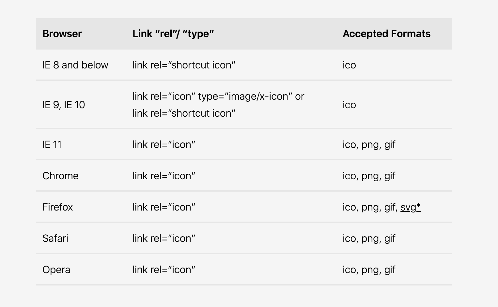
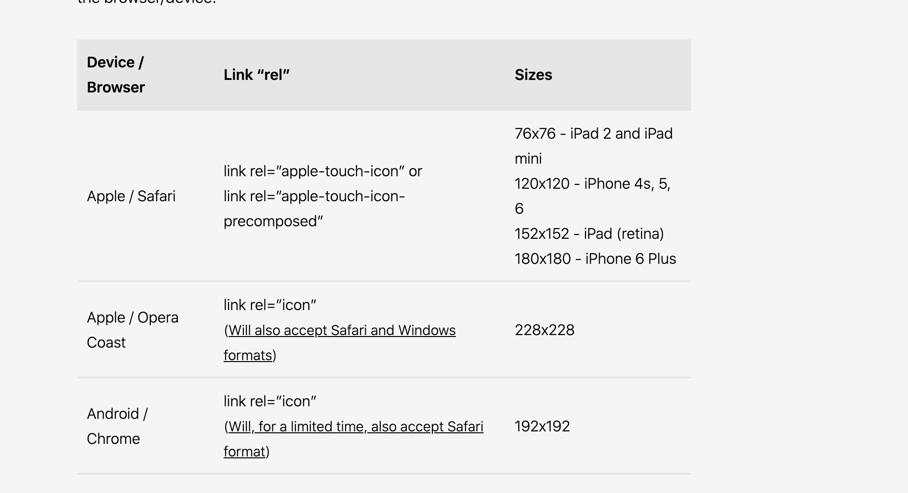

# favicon
https://bitsofco.de/all-about-favicons-and-touch-icons/  
https://github.com/audreyr/favicon-cheat-sheet


# shortcut icon VS icon

## shortcut icon VS icon 지원 현황


## shortcut 쓰지마라
- shortcut 이라는 것은 link 태크의 attribute 를 설명하는 html스펙에 나와 있지도 않는 것이다. 어차피 icon 속성이 없으면 브라우저는 페이지의 root path 에서 favicon.ico 를 찾아 다닐꺼다. IE8 이하에서 shortcut이 허용 되는 건 맞지만 정식 스펙도 아니니까 그냥 쓰지마라
- (https://html.spec.whatwg.org/multipage/links.html#linkTypes)

- html 스펙에서 허용은 한다. (역사적인 이유로)
- For historical reasons, the HTML specification now allows the use of shortcut as a link relation if it’s immediately followed by a single U+0020 space character and the icon keyword. Of course, it’s still better not to use any HTML at all. (https://mathiasbynens.be/notes/rel-shortcut-icon)

- For historical reasons, the icon keyword may be preceded by the keyword "shortcut". If the "shortcut" keyword is present, the rel attribute's entire value must be an ASCII case-insensitive match for the string "shortcut icon" (with a single U+0020 SPACE character between the tokens and no other ASCII whitespace). (https://html.spec.whatwg.org/multipage/links.html#rel-icon)
- 역사적 이유로, 아이콘 키워드 앞에는 "shortcut" 이라는 키워드가있을 수 있습니다. "shortcut"키워드가 존재하면 rel 속성의 전체 값은 문자열 "shortcut icon"에 대해 ASCII 대소 문자를 구분하지 않아야합니다 (토큰 사이에 단일 U + 0020 SPACE 문자가 있고 다른 ASCII 공백은 없음). 

### type
- link에 type을 지정해 주는데 스펙에 나와 있기로는 `type은 순수하게 useragent에게 이게 무슨 타입인지 힌트만 주는 것으로(지원 안하면 다운받지 마라) type내용은 신뢰성이 없는 것으로 본다.` 라고 나와 있으나, 
- IE9 와 IE10은 type attribute의 값으로 `image/x-icon` 을 필수적으로 요구 하고 있다. 대신 shortcut icon 을 쓰지 않아도 된다. 

### shortcut 과 함께 ico 를 쓰면안되는 가장 큰 이유
- 이러한 차이점을 바탕으로 최신 방법을 사용하는 png 파일과 IE8 방법을 사용하는 ico 파일의 두 가지 버전을 선언하는 것이 가장 좋은 방법 인 것 같습니다. 그러나 일부 최신 브라우저는 순서에 관계없이 연결된 png 파일 대신 연결된 ico 파일을 선택하는 것으로 보입니다. 즉, 이전 IE 브라우저에 수용하려고하면 최신 브라우저에 잘못된 형식이 제공 될 수 있습니다. 이 때문에 가장 좋은 해결책은 png 형식 파일 만 선언하고 이전 브라우저에서 기본값을 폴백으로 사용하도록하는 것입니다.
- Based on these differences, it may seem like the best method would be to declare two versions - the png files using the modern method and an ico file using the IE8 method. However, it appears that some modern browsers will choose a linked ico file over a linked png file, regardless of the order they are placed. This means that, if we try to accomodate for the older IE browsers, the modern browsers may be served the wrong format. Because of this, the best solution may be to only declare the png format files, and let older browsers use the default as a fallback. (https://bitsofco.de/all-about-favicons-and-touch-icons/)

- Chrome, Firefox, Opera 7+, 그리고 Safari 4+는 모두 PNG 파비콘을 지원하지만 Chrome과 Safari는 ICO 파비콘이 함께 지정되어 있으면 선언된 순서에 상관없이 PNG 파비콘을 무시하고 ICO 파비콘을 사용한다. 즉, PNG 파비콘을 지원하지 않는 IE를 위해 ICO 파일을 사용하게 되는 순간, Chrome과 Safari는 PNG 파비콘을 무시하게 된다는 이야기다.(https://webdir.tistory.com/337 )

### 그럼 ico만 쓰는 건 어떠한가?
- 그러나 ico 형식을 사용하면 제한이있을 수 있습니다. 투명성을 지원하지 않으며(그런데 지원하는것 같다..?) 웹에 가장 최적화되지 않았습니다. 요즘에는 png, gif, jpeg 및 제한된 상황에서 svg를 포함한 광범위한 형식을 사용할 수 있습니다. 

- 정리하면서 생각한건데, ico 만 쓰는 것도 하나의 방법이다. (https://stackoverflow.com/questions/1344122/favicon-png-vs-favicon-ico-why-should-i-use-png-instead-of-ico)


### shortcut 과 함께 ico을 쓸때 홈스크린 버튼이 적용되는 방식은 좀 다르다. 
- 파비콘의로서 역할은 ico 파일을 png 보다 우선시 하는 것은 맞으나, 
- 홈스크린 버튼으로서 적용될때는 꼭 위의 조건으로 적용되는 것이 아니다.
- 알맞은 사이즈를 파악 하는 것인지, png를 우선 하는지 몰라도 ico 파일이 무조건 우선적오로 적용되지 않았다. 
- 아마 png 우선인듯 하다

```html
<!-- For IE 10 and below -->
<!--  No link, just place a file called favicon.ico in the root directory -->

<!-- For IE 11, Chrome, Firefox, Safari, Opera -->
<link rel="icon" href="path/to/favicon-16.png" sizes="16x16" type="image/png">
<link rel="icon" href="path/to/favicon-32.png" sizes="32x32" type="image/png">
<link rel="icon" href="path/to/favicon-48.png" sizes="48x48" type="image/png">
<link rel="icon" href="path/to/favicon-62.png" sizes="62x62" type="image/png">

```

## shortcut 써라
- 아무튼 스펙은 아닌데 IE8 이하에서는 이거 지원하니까 걍 써라


# apple-touch-icon AND apple-touch-icon-precomposed
- apple-touch-icon 와 apple-touch-icon-precomposed 가 같이 쓰이면 apple-touch-icon-precomposed 우선 적용


## apple-touch-icon
- 애플기기의 홈스크린 아이콘
- ios7 이전에는 이 파일에 디폴트 이펙트를 첨가 시켜 보여줬다. (빛나게 보이던거)
- ico 파일 적용 됨

## apple-touch-icon-precomposed
- 지금은 필요 없지만
- ios7 이전에 빛나게 보여주기 싫을때 쓰던 것 
  

# apple-touch-icon VS apple-touch-icon-precomposed

## 이미지로 알아본 차이점
http://blog.karlribas.com/2012/05/how-to-create-apple-touch-icon-for-your.html

## 자세한 설명
https://webhint.io/docs/user-guide/hints/hint-apple-touch-icons/#page-heading

## 각종 CASE
apple-touch-icon-precomposed 우선적용

```html
  <link rel="apple-touch-icon" href="images/icons/256x.png">
  <link rel="apple-touch-icon-precomposed" sizes="72x72" href="images/icons/72x.png">
  <link rel="apple-touch-icon-precomposed" sizes="256x256" href="images/icons/256x.png">
  <link rel="apple-touch-icon-precomposed" sizes="192x192" href="images/icons/192x.png">
  <link rel="apple-touch-icon-precomposed" sizes="128x128" href="images/icons/128x.png">
```

- 이걸 아이폰에서 실행하면
- precomposed 우선이므로 apple-touch-icon 무시
- 적용 이미지는....그냥 적절한거 찾아서 선정하는듯. 순서는 중요치 않다
- sizes 프로퍼티에 따라 적절한걸 찾는거 같은데, ico 파일도 무리 없이 적용된다
- 그냥 180짜리 하나만 넣어놓면 알아서 줄여서 쓴다고 한다.
- 추가로 위 예시에서 sizes 속성 제거 하고 ico 파일 중간에 놓고, 순서도 뒤죽박죽으로 여러 케이스를 시도해 보았는데
- ~~ico 파일의 여부는 관계 없이 브라우저가 알아서 아이콘 사이즈를 선택 하는 것같다.~~
- 아니다! 사이즈 속성이 있으면 사이즈 속성으로 골라서 가져가고 (ico 여부 상관없이)
- 사이즈 속성 없으면 첫번째것을 가져간다!
- 사이즈 속성이 하나라도 있으면 그 사이즈가 알맞으면 그 사이즈 부터 데려 간다!!!!

## apple-touch-icon-precomposed
- android도 지원한다.
- https://mathiasbynens.be/notes/touch-icons
- 안드로이드가 homescreen 아이콘을 선택 할때 선택지에 rel=icon 뿐 아니라 apple-touch-icon, apple-touch-icon-precomposed도 후보에 넣는다. 
- icon 이 부적절하면 apple-touch-icon에서 빼가는 것 같고, 이것도 별로면 apple-touch-icon-precomposed을 사용하는 듯하다. 
- 적절한것을 빼간다.

## touch icon 


## 왜 이렇게 적용 하는가?
```html
	<link rel="icon" sizes="192x192" href="favicon_192.png">
  <link rel="shortcut icon" href="favicon.ico?_=1911271310" type="image/x-icon">
```

- 위 예제 에서 ico 랑 png 랑 같이 썼으니 파피콘 역할로는 ico 가 png 를 무시하고 자기가 선정된다. 
- 그런데, 이경우 manifet가 없다면 두 파일은 안드로이드의 homescreen 아이콘 후보가 된다. 
- 그때에는 png가 ico를 무시하고 자기가 선정된다. 
- homescreen을 생각안하면 ico 파일만 사용하면 된다.
- 근데 ico 파일만 있으면 homescreen에는 또 ico 파일이 잘 적용된다. 
- 데데데데데데데헷

# 결론
```html
    <link rel="shortcut icon" th:href="|${ui['wstatic.common']}/${menu.project}.ico|" type="image/x-icon"> <!-- ico 파일 128(홈스크린 아이콘용-manifest 없을때), 64, 48, 32, 16-->
    <link rel="apple-touch-icon" th:href="|${ui['wstatic.common']}/${menu.project}.png|"> <!-- 180x180-->
    <!-- 만약 아이폰 5s 이전 기종(ios 업데이트 안했다는 조건아래)에서, ios에서 디폴트로 지원하는 아이콘 반짝이 효과를 안주고 싶을때 넣는다.(이건 제외해도 된다.)  -->
    <link rel="apple-touch-icon-precomposed" th:href="|${ui['wstatic.common']}/${menu.project}.png|"> 
```
- 안드로이드 홈스크린 아이콘 기준으로 icon 이 64만 있을때 일단 후보군 탈락에 apple-touch-icon을 후보로 삼는다. 
- 안드로이드 홈스크린 아이콘 기준으로 icon 이 128 있을때 일단 채택된다. 
- ie9 이상에서 `shortcut`이 없어도 `type="image/x-icon"` 이 있으면 적용된다. 
- ie9 이하에서는 `shortcut`이 있어야 한다. 

