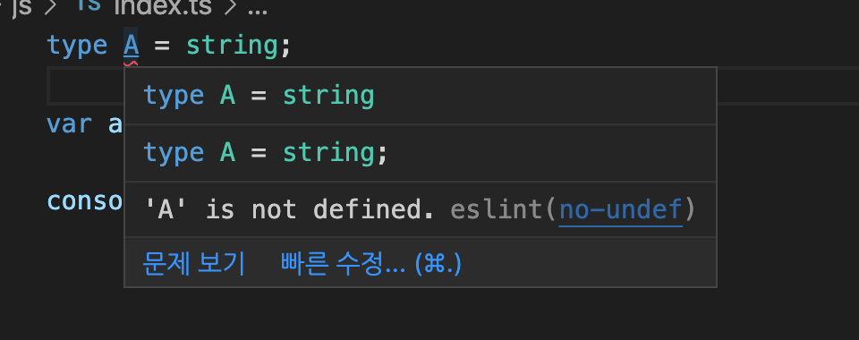

# eslint 
좋은 참고 문서 -> https://develoger.kr/frontend/eslint-%ea%b8%b0%eb%b3%b8%ec%a0%81%ec%9d%b8-%ec%82%ac%ec%9a%a9%eb%b2%95/

https://velog.io/@kyusung/eslint-config-2
# @babel/eslint-parser
[@babel/eslint-parser](https://www.npmjs.com/package/@babel/eslint-parser)
>You only need to use @babel/eslint-parser if you are using Babel to transform your code. If this is not the case, please use the relevant parser for your chosen flavor of ECMAScript (note that the default parser supports all non-experimental syntax as well as JSX).

>you don't have to use it just because you are using Babe

즉, 타입스크립트정도 사용할때만 @babel/eslint-parser 를 사용하라는 이야기. 바벨 쓴다고, @babel/eslint-parser 를 사용하는 것은 아니라는 이야기 이다. 

# 그럼 parser 란
> ESLint는 사용자 정의 파서를 사용할 수 있습니다. 이 플러그인을 사용하면 Babel의 파서(Babel 구성 파일에 지정된 구성 사용)가 코드를 구문 분석하고 결과 AST는 ESLint가 이해할 수 있는 ESTree 호환 구조로 변환됩니다. 행 번호, 열과 같은 모든 위치 정보도 유지되므로 오류를 쉽게 추적할 수 있습니다.

# Class fields
그런데 [Class fields](https://developer.mozilla.org/ko/docs/Web/JavaScript/Reference/Classes/Public_class_fields) 사용하려면 [@babel/eslint-parser](https://www.npmjs.com/package/@babel/eslint-parser) 사용해야 한다. 
왜냐하면 아직 stage3 이니까 그렇겠지...


# 실험적 기능이란
https://github.com/eslint/eslint/blob/a675c89573836adaf108a932696b061946abf1e6/README.md#what-about-experimental-features

ESLint's parser only officially supports the latest final ECMAScript standard. We will make changes to core rules in order to avoid crashes on stage 3 ECMAScript syntax proposals (as long as they are implemented using the correct experimental ESTree syntax). We may make changes to core rules to better work with language extensions (such as JSX, Flow, and TypeScript) on a case-by-case basis.

In other cases (including if rules need to warn on more or fewer cases due to new syntax, rather than just not crashing), we recommend you use other parsers and/or rule plugins. If you are using Babel, you can use the babel-eslint parser and eslint-plugin-babel to use any option available in Babel.

Once a language feature has been adopted into the ECMAScript standard (stage 4 according to the TC39 process), we will accept issues and pull requests related to the new feature, subject to our contributing guidelines. Until then, please use the appropriate parser and plugin(s) for your experimental feature.

# parser & plugin 
In other cases (including if rules need to warn on more or fewer cases due to new syntax, rather than just not crashing), we recommend you use other parsers and/or rule plugins. If you are using Babel, you can use the babel-eslint parser and eslint-plugin-babel to use any option available in Babel.
> 다른 경우(단순히 충돌하지 않는 것이 아니라 새로운 구문으로 인해 규칙이 더 많거나 적은 경우에 대해 경고해야 하는 경우 포함)에는 다른 파서 및/또는 규칙 플러그인을 사용하는 것이 좋습니다. Babel을 사용하는 경우 babel-eslint 파서 및 eslint-plugin-babel을 사용하여 Babel에서 사용 가능한 모든 옵션을 사용할 수 있습니다.

# extends VS plugin
extends는 다른 사람이 만든 규칙을 가져와서 내 규칙에 붙여서 확장되는거고, plugin은 다른사람이 만든 규칙을 가져오는것이다. 다시말해 extends에 그냥 뭘 확장할건지만 써주면 자동으로 rules에 rule group이 추가 되고, plugin을 쓸때는 내가 일일이 rules에 적어줘야한다. (아님 extends랑 섞어서 쓰던지)

# 즉....
파서만 가져다 쓰면 (@babel/eslint-parser) 내가 작성한 코드의 stage3 문법을 추상구문트리(abstract syntax tree, AST)로 만들수 있다. 만약 stage3 문법을 사용했는데, 파서가 기본 파서라면 eslint 에서 파싱애러가 난다. 

일단 적절하게 파싱이 되었으면, 이제 그 파싱한 내용을 분석해야 하는데 (이게 애러 인지 아닌지) 그걸 정의해논게 plugin 이다. 즉, 파싱은 제대로 했는데, 플러그인이 업다면 기껏 파싱해놓은 정보를 사용하지 않겠다라는 의미이다. 확실하지는 않지만 플러그인 자체는  rule 이 다 허용으로 되어 있고, 이 룰을 애러로 바꾸려면 수동으로 작성해 줘야 한다. 
> extends는 추가한 플러그인에서 사용할 규칙을 설정합니다.
플러그인은 일련의 규칙 집합이며, 플러그인을 추가하여도 규칙은 적용되지 않습니다.
규칙을 적용하기 위해서는 추가한 플러그인 중, 사용할 규칙을 추가해주어야 적용이 됩니다. (https://velog.io/@kyusung/eslint-config-2)

즉,규칙을 적용한다는 것은 특정한 rule 에 error 를 설정한다는 것이고, 이 Rule 을 세팅해놓은게 extends 옵션의 `eslint:recommended` 와 같은 내용이다. 
> 여기서 eslint-plugin- 접두사를 생략하고 plugin:를 사용하여 사용할 플러그인을 지정할 수 있습니다. eslint:all과 eslint:recommended는 ESLint에 기본으로 제공되는 확장입니다. ESLint는 eslint:all를 프로덕션 용도로 사용하지 않기를 권장하고 있습니다. (https://velog.io/@kyusung/eslint-config-2)

# 결론
나누어서 생각하자

eslint 가 구문분석을 위해 parser 를 사용한다. 
적절하지 않은 parser 라면 애러가 난다. 
파싱이 되면 이제 어느 부분이 애러인가를 정의해야 한다. 이것이 플러그인.
플러그인을 설치했으면 이제 문장에 오류가 있을때 애러를 발생시킬지, 경고를 띄울지 결정한다. 이것이 Rule.
그리고 Rule을 미리 정의 해놓은 것이 extends 이다 

[추가] extends 에 plugin: 을 사용하면 plugin 도 같이 지정해 주는 식이 되서 plugin 을 따로 지정해 주지 않아도 된다. (90% 확실한 추측...)

** [추가] 위에말은 거의 다 틀린말.. **
아.... 근데 이걸 파악하는게 정말나에게 도움이 되는건지 잘 모르겠다. 
https://eslint.org/docs/latest/user-guide/configuring/configuration-files#extending-configuration-files

extends 에는 모든게 다 들어갈수 있다. 말 그대로 컨피그 파일을 extends 하는 내용인데
plugin 을 포함해서 어떤거든 들어갈수 있다. 
즉, extends에 적용한 내용에 따라, plugin 을 넣을지, 아니면 룰만 넣을지 결정 된다는 이야기

예를 들면 https://eslint.vuejs.org/user-guide/#usage 에 보면 vuejs를 위한 eslint-plugin의 사용법이 나와 있는데, 
extends에 어떤걸 적용하느냐에 따라 적용 되는 내용이 달라 진다는 이야기 이다. 
`plugin:vue/base` 혹은 `plugin:vue/vue3-essential`을 extends에 적용하면 `parser`까지 적용 되지만, 
다른 것들은 `rule` 만 적용 되는 경우도 있는 것이다. 

```
Bundle Configurations
This plugin provides some predefined configs. You can use the following configs by adding them to extends.

"plugin:vue/base" ... Settings and rules to enable correct ESLint parsing.
Configurations for using Vue.js 3.x.
"plugin:vue/vue3-essential" ... base, plus rules to prevent errors or unintended behavior.
"plugin:vue/vue3-strongly-recommended" ... Above, plus rules to considerably improve code readability and/or dev experience.
"plugin:vue/vue3-recommended" ... Above, plus rules to enforce subjective community defaults to ensure consistency.
Configurations for using Vue.js 2.x.
"plugin:vue/essential" ... base, plus rules to prevent errors or unintended behavior.
"plugin:vue/strongly-recommended" ... Above, plus rules to considerably improve code readability and/or dev experience.
"plugin:vue/reco
```

** [추가] `eslint-plugin-vue` 에 대해 좀더 알아보면 ** 
https://eslint.vuejs.org/
https://github.com/vuejs/vue-eslint-parser#readme

바로 위에 쓴것처럼 extends에 `plugin:vue/vue3-essential` 을 사용하면 `parser` 도 `vue-eslint-parser` 를 사용하도록 `extends!` 된다. 
그런데 eslint-plugin-vue 에서는 이 파서의 목적은 .vue 파일 안에 있는 <template> 구문을 파싱 하기 위한 것이라고 설명 하고 있다. 

```
This parser allows us to lint the <template> of .vue files. We can make mistakes easily on <template> if we use complex directives and expressions in the template. This parser and the rules of eslint-plugin-vue would catch some of the mistakes.
```

그럼 .vue 파일 안에 있는 `<script>` 안의 내용은 어떻게 파싱을 해야 하는가?
```
You can use parserOptions.parser property to specify a custom parser to parse <script> tags. Other properties than parser would be given to the specified parser. For example:
{
    "parser": "vue-eslint-parser",
    "parserOptions": {
        "parser": "@babel/eslint-parser",
        "sourceType": "module"
    }
}
```

`parserOptions` 옵션 안에 `parser`의 옵션을 통해 정의 하라고 나온다. 

실제로 `.vue` 파일에 `<script lang="ts">` 가 있는데, eslint 에 `vue-eslint-parser` 만 있고 `@babel/eslint-parser` 게 없으면 타입스크립트 구문 자체를 인식하지 못한다. (eslint 가 해당 구문을 애러로 판단한다.)

이제 조금 햇갈리는 부분인데, 
실제로는 `parserOptions` 옵션 안에 `parser`의 옵션에 아무것도 없는데, 타입스크립트 구문을 애러 없이 표현 하는 부분이 있다. 

여기서 `extends`의 역할을 또 한번 살펴 봐야 하는데, `extends`에 분명히 다른게 적혀 있을 것이다. 
```
  "extends": [
    "plugin:vue/vue3-essential",
    "eslint:recommended",
    "@vue/typescript/recommended"
  ],
```

위 extends중 `@vue/typescript/recommended`는 https://www.npmjs.com/package/@vue/eslint-config-typescript 인데, 
햇갈림 중 하나가 eslint config 파일안에서는 `eslint-config` 라는 prefix를 빼고 적어도 `eslint-config` 가 있다고 판단한다는 것이다. 

```text
https://eslint.org/docs/latest/user-guide/configuring/configuration-files#extending-configuration-files

The eslint-config- prefix can be omitted from the configuration name. For example, airbnb resolves as eslint-config-airbnb.

```

아무튼 하나씩 살펴 보면, 
`plugin:vue/vue3-essential` 는 위에 설명 했듯이 `vue-eslint-parser` 를 사용하도록 `extends!` 된다.
그리고 `@vue/typescript/recommended` 즉, `@vue/eslint-config-typescript/recommended` 는 아래의 코드를 가지고 있다.
parserOptions를 덮어 쓰고 있다. 

중요한점 하나..! recommended 라고 해서 rule만 가지고 있는건 아니라는 거다.

```json
parserOptions: {
    parser: {
      'js': 'espree',
      'jsx': 'espree',

      'ts': require.resolve('@typescript-eslint/parser'),
      'tsx': require.resolve('@typescript-eslint/parser'),

      // Leave the template parser unspecified, so that it could be determined by `<script lang="...">`
    },
    extraFileExtensions: ['.vue'],
    ecmaFeatures: {
      jsx: true
    }
  },

```

거지 같다.

왜 난 이딴걸 보고 있지?

# `@babel/eslint-parser`
- 중요! `babel-eslint` 는 디프리케이티드다! 쓰지 말자. 계속 말도 안되는 애러 남!


# 진짜 쓸때없는거 진짜로....with VSCODE (typescript를 적용할 경우) 
- 일단 `@babel/eslint-parser`를 사용하면 typescript 파일 파서는 가능하다. (가능은하다)
- 중요한건 `@babel/eslint-parser` 으로 `타입스크립트` 를 파싱하려면 당연히 `.babelrc`에 `@babel/preset-typescript`가 있어야 한다!!
- 가능은 하다는말은 파싱은 했는데, 적절한 플러그인 (`@typescript-eslint/eslint-plugin`) 이 없다면, 타입스크립트의 문법을 잘못써도, 이게 잘못인지를 모른다. 
- 그럼 이론적으로 `@babel/eslint-parser` 로 파싱하고 `@typescript-eslint/eslint-plugin` 으로 문법 체크를 하면 되는거 아닌가 하는데, 이렇게 해도 제대로 체크가 안된다.

- (파싱애러는 안나는데, 막 말도 안되는 문법 오류가 난다. 스샷을 보면 type인데 no-undef 애러가 난다) - plugin 에 있는 규칙은 잘 적용되기도 한다
- 
- 이건 플러그인의 문제라기 보다는 파싱애러가 안날 뿐이지 파싱이 잘못되서, type인데도 불구 하고 정의를 안해줬다고 애러를 밷는거 같다. 
- [추가] 이거.....음... `@typescript-eslint/parser` 사용할때에도 `no-undef` 에러 나는거 같다. `@typescript-eslint/parser` 문서에 `no-undef` 옵션 끄는걸 추천한다고 나온다. (https://typescript-eslint-armano.netlify.app/docs/getting-started/linting/troubleshooting/). `@typescript-eslint/recommended` 에서 자동으로 꺼주는 것이었다.

-  `no-undef` 와 별개로, 타입스크립트에 `@babel/eslint-parser` 을 쓰지 말라고 하는 이것에 대한 내용은 `@babel/eslint-parser`의 [공식문서](https://github.com/babel/babel/tree/main/eslint/babel-eslint-parser#typescript)에도 나와 있다.
 
> While @babel/eslint-parser can parse TypeScript, we don't currently support linting TypeScript using the rules in @babel/eslint-plugin. This is because the TypeScript community has centered around @typescript-eslint and we want to avoid duplicate work. Additionally, since @typescript-eslint uses TypeScript under the hood, its rules can be made type-aware, which is something Babel doesn't have the ability to do.


- 그럼 `@typescript-eslint/parser` 로 파싱하고 `@typescript-eslint/eslint-plugin` 로 문법 체크 하면 완벽하게 되긴 한다. 
- `@typescript-eslint/eslint-plugin` 에 있는 문법은 [이거와 같다](https://github.com/typescript-eslint/typescript-eslint/tree/main/packages/eslint-plugin#supported-rules)


- 아무튼 이게 정석인데
## eslint 를 cli 에서 실행할 경우 
- ~~eslintrc 옵션중 `overrides:{files:["*.ts"]}` 가 있어야 ts 파일을 린트 검사한다. (`npx eslint ./src/js/`) - 폴더를 검사할때 이다. (개별 파일은 검사한다.)~~
- 그냥 `@babel/eslint-parser` 든 `@typescript-eslint/parser` 든 있으면, (`npx eslint ./src/js/`) 로 하면 ts 파일도 체크 해준다.

## vscode 에서는
- `overrides:{files:["*.ts"]}`  을 따라가지 않고 vscode setting 중에 ` "eslint.validate": ["javascript", "javascriptreact", "typescript"]` 를 바라 본다. 
- 그런데 vscode의 확장프로그램인 eslint 의 공식 문서를 보면 (https://marketplace.visualstudio.com/items?itemName=dbaeumer.vscode-eslint)

> Improved TypeScript detection - As soon as TypeScript is correctly configured inside ESLint, you no longer need additional configuration through VS Code's eslint.validate setting. The same is true for HTML and Vue.js files.

- 즉, eslintrc 를 적절하게 구성하면 validate 설정이 없어도, ts 파일을 잘 감시해서 문법 체크를 한다는 이야기이다.
- 여기서 잘 구성이라는 건 현재로서는 `@typescript-eslint/parser` 를 eslint에서 사용한다고 잘 설정 했을때를 말한다. 

# 추가로 @babel/eslint-parser 깃헙에 보면
- https://github.com/babel/babel/issues/11995#issuecomment-708651689
> Sorry, should have clarified - I meant in conjuction with @typescript-eslint/parser. We've left linting TypeScript to @typescript-eslint due to all the duplicated work and lack of type information that actually using tsc gives you (i.e. @typescript-eslint/parser rules can actually access type information!). The assumption is that if you're running tsc over your files, @typescript-eslint/parser will be able to lint it. If you're doing some sort of two pass transformation (transforming syntax features not supported by TypeScript with Babel and then running tsc), that's currently not a supported use case.

>  죄송합니다. 명확히 했어야 했습니다. @typescript-eslint/parser와 함께 사용하려고 했습니다. 모든 중복 작업과 실제로 tsc를 사용하여 제공하는 유형 정보의 부족으로 인해 TypeScript를 @typescript-eslint에 린팅했습니다(즉, @typescript-eslint/parser 규칙은 실제로 유형 정보에 액세스할 수 있습니다!). 파일에 대해 tsc를 실행하는 경우 @typescript-eslint/parser가 파일을 린트할 수 있다고 가정합니다. 일종의 2단계 변환(TypeScript에서 지원하지 않는 구문 기능을 Babel으로 변환한 다음 tsc를 실행)을 수행하는 경우 현재 지원되지 않는 사용 사례입니다.

>  @kaicataldo는 typescript의 경우 여전히 @typescript-eslint/parser를 사용해야 한다는 의미인가요? @babel/eslint-parser가 아니라

> That's right!

- 그러니까 typescript 쓸꺼면 @typescript-eslint/parser 를 쓰라는 이야기 이다.
- 그럼 그냥 파싱은 가능하다는 이야기는 왜 한걸까?