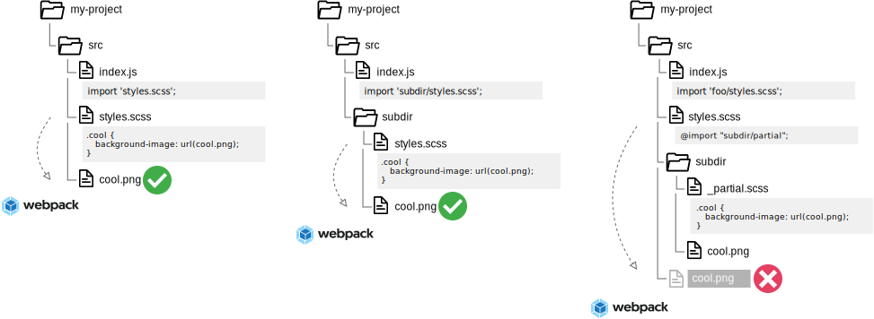

# resolve-url-loader
웹팩에서 css / scss 확장자에 적용하는 로더중 하나. 

# 왜 사용해야 하는가?
scss 나 css가 모듈 형식으로 여러 경로에 있는 파일을 하나로 빌드 할때, 
이미지등을 위한 상대경로의 url 이 모두 루트 기준으로 변경된다. 

# 참고
https://www.npmjs.com/package/resolve-url-loader

