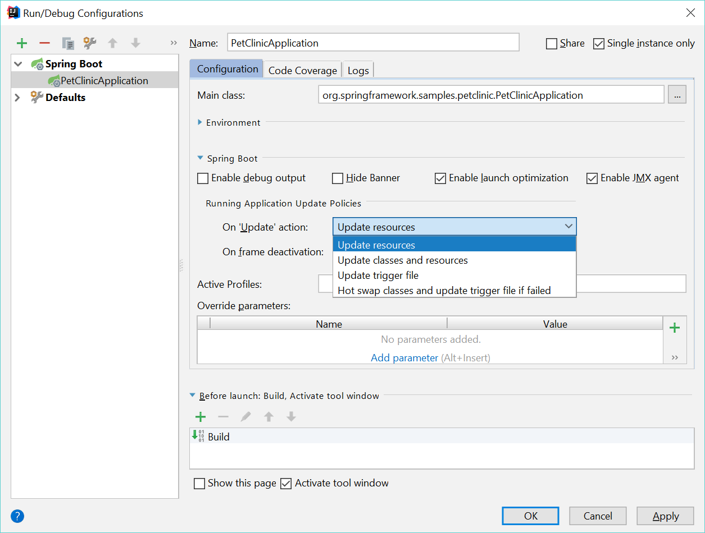

https://blog.jetbrains.com/idea/2018/04/spring-and-spring-boot-in-intellij-idea-2018-1/

https://docs.spring.io/spring-boot/docs/current/reference/html/using.html#using.devtools

# 이슈
IntelliJ 에서 spring 을 돌리때? html파일을 수정 후 브라우저 새로고침을 해도 반영이 안되는 경우가 있는데, 
아마도!? spring boot developer tools 가 없어서 그럴 것이다. 

# 1. maven 설정
```xml
// pom.xml
<dependencies>
    <dependency>
        <groupId>org.springframework.boot</groupId>
        <artifactId>spring-boot-devtools</artifactId>
        <optional>true</optional>
    </dependency>
</dependencies>
```

# 2. intelliJ 설정

