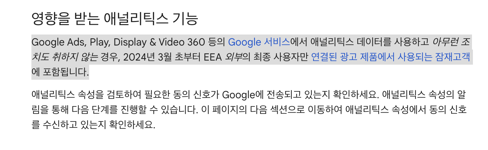
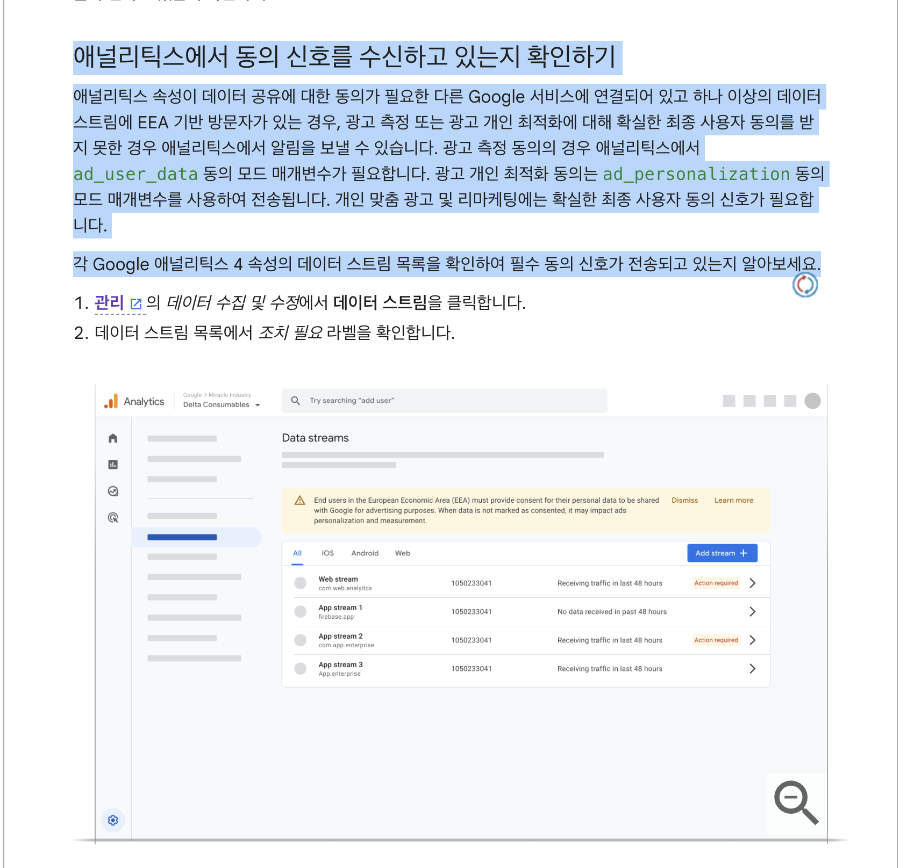
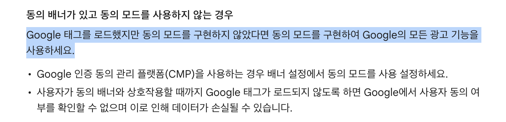
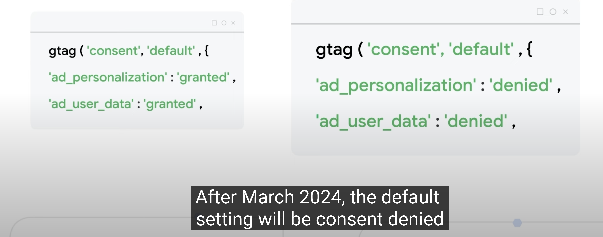

- [GA4] Google 애널리틱스에서 동의 설정 확인 및 업데이트하기
https://support.google.com/analytics/answer/14275483#next-steps

- [태그관리자] 유럽 경제 지역(EEA)의 트래픽에 대한 동의 모드 업데이트
https://support.google.com/tagmanager/answer/13695607

- [Google Ads] 개인 맞춤 광고
https://support.google.com/adspolicy/answer/143465

# 이해
## [어제 오후 3:30] 김지상(Kim Jeesang)(jscrom)
제가 이해하기로는 이번 동의는 구글 시그널 활성화를 할때, `구글에서 GDPR에 따른 동의를 요구한다.`로 알고 있는데요, 
지금 문의주신것은 이번 구글에서 `동의요구하는 구글 시그널`은 유럽 지역에서 `비활성화`를 하였으나, 구글 시그널이 아닌 부분을 통해 EU인의 정보가 구글 애널리스트쪽으로 수집되어 조회가 된다는 말씀이신지요?
 
저희쪽에서는 지금 당장은, 구글 시그널이 아닌, 
`즉 구글회사에서 동의를 요구하지 않는 정보가 인입되는 것은 문제가 되지 않을것으로 보입니다.`
다만 말씀하신 부분에서 조회가 되는 정보가 어떤 정보일까요?

## [어제 오후 3:34] 이명휘(lee myung hwi)(suhoshin97)
구글 시그널 데이터를 제외한 일반 정보일 것으로 생각합니다.
구글 애널리틱스4에는 `사용자의 구글 로그인 기반 데이터나 인구 통계 데이터가 자동 수집 되지 않습니다.`
`구글 시그널을 켜야만` 해당 데이터가 들어오는데요
구글 시그널을 제외하였으니, 광고 관련 데이터나 인구 통계 정보를 제외한
`쿠키 기반으로 수집되는 정보들이 들어올 것으로 보입니다`

쿠키 레이어가 구축되어 있으므로 `사용자가 선택한 쿠키 종류`에 따른 데이터가 수집될 것으로 예상하며
구글 애널리틱스는 퍼포먼스 애널리틱스 쿠키 쪽 동의를 했을 때 클라이언트 id 기반 데이터가 모일 수 있을 것으로 예상합니다

## [어제 오후 3:38] 김지상(Kim Jeesang)(jscrom)
네 그부분은 쿠키 동의가 별도로 있으니, 문제 없을것으로 보입니다. 
제가 알고 있는 바로는, 이번 동의는 말씀해주신것처럼 
`구글 로그인 기반의 데이터`가 인입되는 부분에 대한 동의로, 
쿠키값에 동의 받지 않은 이용자도 구글이 어떻게든 사업자한테 전달해주겠다는 사업이 반영된 것으로 보이며, 
이에 따라, 기존 쿠키 동의를 기반으로 들어오는 정보들은 이슈사항이 없으며, 
구글 시그널을 OFF한다면, 
`나머지 정보는 쿠키 동의로 인입되는 것임으로 GDPR 상에서 이슈사항 없습니다`

# 아젠다
1. 동의 모드 구현의 이유
2. 동의 모드 구현 방식(동의 배너가 구현된 이후 동의 모드 적용)
- 웹 GTM 또는 Gtag를 통해 동의 모드 초기 설정 및 동의 사항 업데이트 시 변경 부분에 대한 안내
- 앱 firebase SDK 를 통해 동의 모드 초기 설정 및 동의 사항 업데이트 시 변경 부분에 대한 안내
